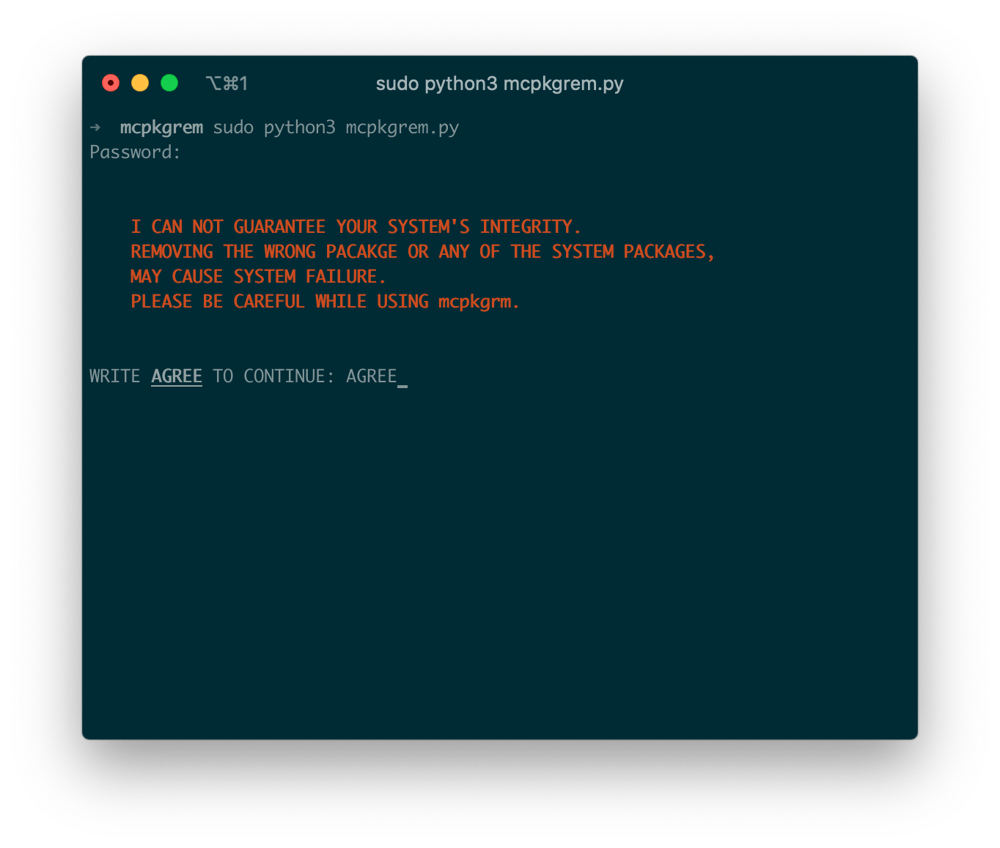
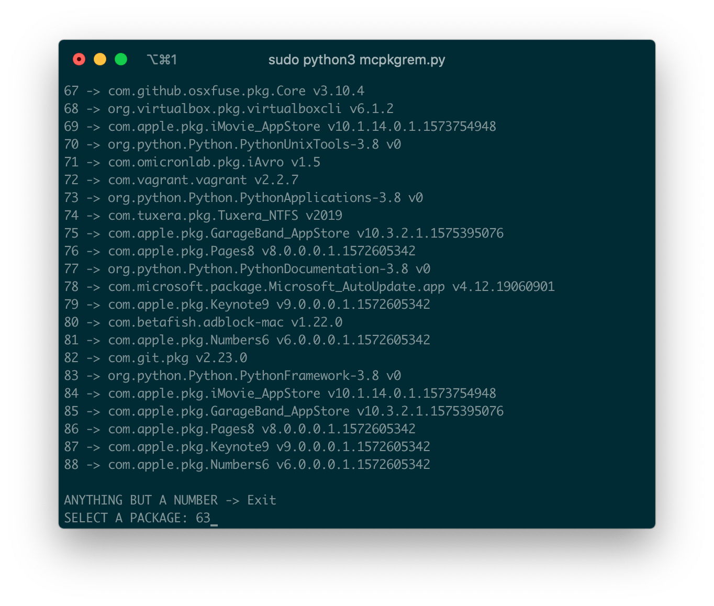
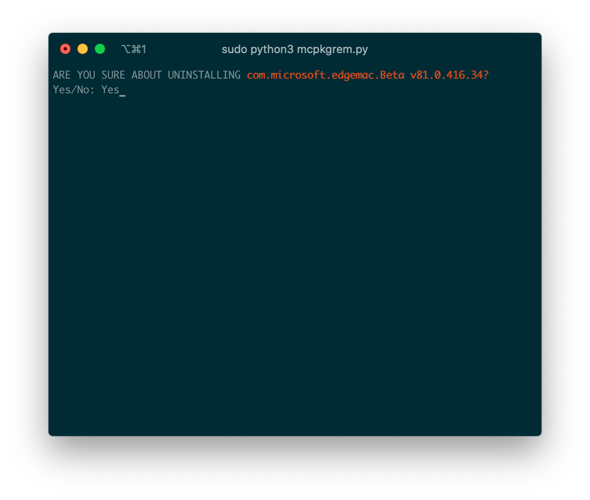
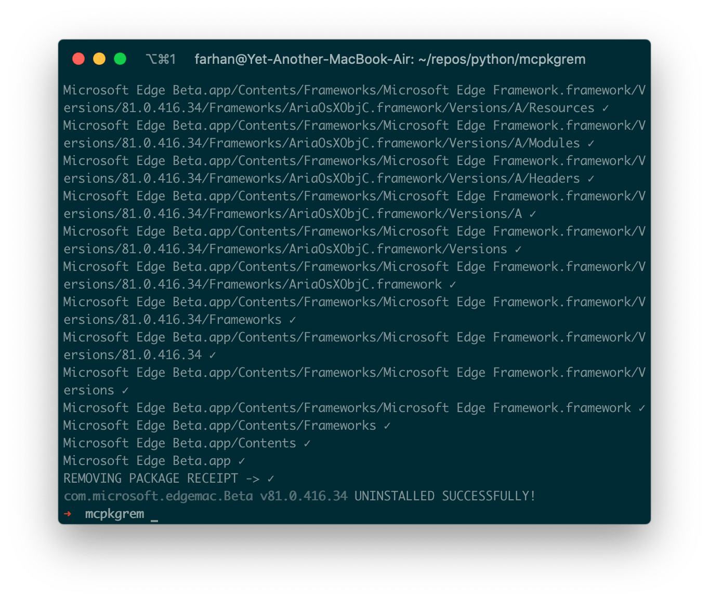

# macOS(mc) Package(pkg) Remove(rm)

In macOS you either copy the application directly into your `Applications` folder or you use a package(.pkg) to install the application using a wizard. Applications installed from a package (.pkg) often install various files outside of the `Applications` folder and that's why removing an application installed from a package(.pkg) is not that straight forward.

macOS itself doesn't provide any method for uninstalling such applications. All it provides is a shell program called `pkgutil` that can be used to view certain information of installed packages but can not be used to uninstall any.

Some applications come with their very own uninstaller but most of the applications don't. There are paid applications out there to do just this.

What I did is I made a simple python program that utilizes `pkgutil` to figure out what files were installed via a package(.pkg), removes them and also cleans the package(.pkg) receipt from the system.

## Requirements

* macOS
* Python 3

## Installation

```shell
git clone https://github.com/fhsinchy/mcpkgrm.git ~/mcpkgrm
cd ~/mcpkgrm
pip install .
pip freeze
```

Output &ndash;

```shell
mcpkgrm==1.0.0
```

## Usage

Once installed, the program should be everywhere in your system.

```shell
sudo python -m mcpkgrm.py
```

You need to type AGREE here for no reason -



Now you'll be shown a list of all installed packages in the system. Select the one you want to uninstall by typing the associated number -



It'll ask for confirmation one last time -



Wait until the process is finished -



Once the success message is being shown check your Applications folder for any leftover and remove manually. macOS often prevents the program from deleting files from that directory. All other files should have been taken care of :relaxed:

## Future

This application was created for my necessities and so far works good for me. I may or may not create a GUI version of this in future.

Regardless of the GUI version though, I'll keep improving the code and make the application better. For now it can not keep track of any symlinks made by any package or can not classify packages installed in the system. Such features may come in future but for now, I'm done.
